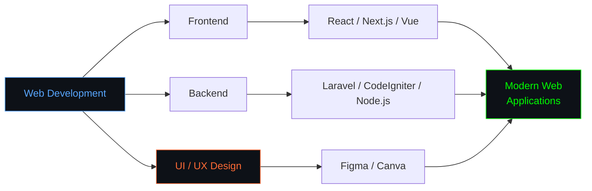
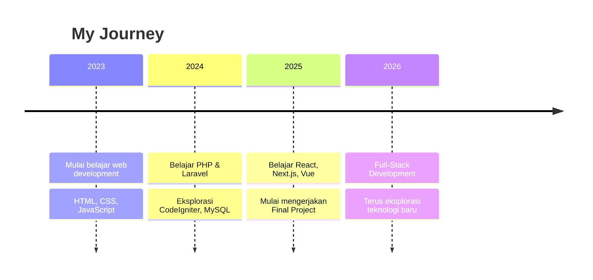

<div data-importer="image" align="center">
  
</div>

###

<div align="center">


[](https://github.com/rifqi-jpg)

[](https://github.com/rifqi-jpg)

<picture>
  <source
    media="(prefers-color-scheme: dark)"
    srcset="https://raw.githubusercontent.com/rifqi-jpg/rifqi-jpg/output/galaga-contribution-graph-dark.svg"
  >
  <source
    media="(prefers-color-scheme: light)"
    srcset="https://raw.githubusercontent.com/rifqi-jpg/rifqi-jpg/output/galaga-contribution-graph.svg"
  >
  
</picture>


</div>

```python
class Rifqi:
    def __init__(self):
        self.name = "Rifqirabbani Aswin"
        self.role = "Full-Stack Web Developer"
        self.location = "Indonesia 🇮🇩"
        self.current_focus = ["Final Project", "Full-Stack Development"]

    def tech(self):
        return {
            "languages": ["PHP", "JavaScript", "Python", "R"],
            "frontend": ["React", "Next.js", "Vue.js", "Tailwind CSS", "Bootstrap"],
            "backend": ["Laravel", "CodeIgniter", "Node.js"],
            "database": ["MySQL", "MongoDB", "SQLite"],
            "tools": ["Git", "GitHub", "Figma", "Canva", "VS Code"],
        }

    def free_time(self):
        return ["coding", "designing", "experimenting with new ideas", "learning new tech"]

me = Rifqi()
```

```text
Junior Web Developer from Indonesia, passionate about building web applications
and exploring new technologies and creativity. Currently learning full-stack
development across both the frontend and backend.
```

<div align="center">


</div>

## 🛠 Tech Stack

<div align="center">

[](https://skillicons.dev)  
[](https://skillicons.dev)  
[](https://skillicons.dev)


</div>

## 🎯 Focus Areas



<div align="center">


</div>

## 🗺️ Journey

<!-- GANTI dengan pengalaman / pendidikan / organisasi kamu yang sebenarnya -->



<div align="center">


</div>

## 🤝 Open to Collaboration

|  **Web Development** <br> Frontend & Backend <br> Landing Page <br> CRUD Apps |  **UI / UX Design** <br> Figma Prototyping <br> Desain Antarmuka <br> Konten Visual |  **Database** <br> MySQL / SQLite <br> MongoDB <br> Perancangan Skema |  **Open Source** <br> Project Komunitas <br> Belajar Bareng <br> Code Review |
| :---: | :---: | :---: | :---: |

<div align="center">


## 📊 My Stats


*"Always learning, always building — one project at a time."*

<a href="https://instagram.com/rifqirbbani.a" target="_blank"></a>
<a href="https://discord.com/users/franky.jpeg" target="_blank"></a>
<a href="mailto:rifqirabbani15@gmail.com"></a>
<a href="https://open.spotify.com/user/5id17q811pq9mpapv7rh4dzua" target="_blank"></a>
<a href="https://linkedin.com/in/rifqirabbani-aswin-a7bb56246" target="_blank"></a>
<a href="https://wa.me/6282234516160" target="_blank"></a>

<br><br>

<a href="https://open.spotify.com/user/5id17q811pq9mpapv7rh4dzua">
  
</a>


</div>
